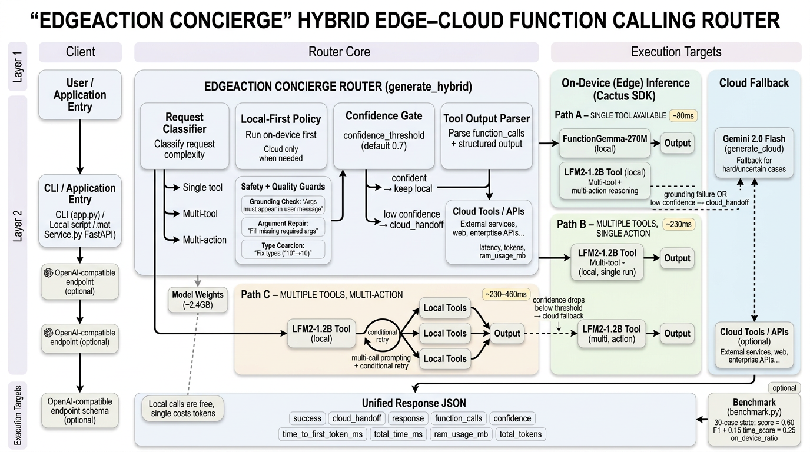

# EdgeAction Concierge

**A hybrid edge-cloud function calling router that runs tool calls locally first — falling back to the cloud only when needed.**

Most function calling today happens entirely in the cloud. Every request ships your user's intent (and sometimes their data) to a remote API, adding latency, cost, and privacy exposure. EdgeAction Concierge flips the default: a 270M parameter model on your device handles the majority of tool calls in under 100ms, with a cloud fallback for the hard cases.

**~89-90% accuracy** on a 30-case function calling benchmark spanning single-tool, multi-tool selection, and multi-call scenarios.




---

## Why This Matters

| | Cloud-only | EdgeAction Concierge |
|---|---|---|
| **Latency** | 300-800ms per call | ~80ms local, ~230ms cloud fallback |
| **Privacy** | Every request leaves the device | Simple requests never leave the device |
| **Cost** | Pay per token, every time | Local calls are free; cloud only when needed |
| **Offline** | No connection = no tools | Single-tool calls work offline |

---

## How It Works

The router in `main.py` classifies each request and picks the fastest reliable path:

| Path | When | Model | Avg Latency |
|------|------|-------|-------------|
| **A** | Single tool available | FunctionGemma-270M (local) with grounding check, cloud backup | ~80ms |
| **B** | Multiple tools, single action | LFM2-1.2B (local) single run | ~230ms |
| **C** | Multiple tools, multi-action | LFM2-1.2B (local) with conditional retry | ~230-460ms |

Three core functions drive the system:

- **`generate_cactus(messages, tools)`** — Runs FunctionGemma locally via the Cactus SDK
- **`generate_cloud(messages, tools)`** — Calls Gemini 2.0 Flash as a cloud fallback
- **`generate_hybrid(messages, tools)`** — The routing logic that picks the best path

### Key Techniques

- **Grounding check** — Detects hallucinated argument values by verifying they appear in the user message
- **Argument repair** — Fills missing required arguments by extracting values from the user's words
- **Type coercion** — Fixes common type mismatches (e.g., `"10"` → `10` for integer params)
- **Multi-call prompting** — Specialized system prompt for queries requiring multiple tool calls

---

## Setup

Requires a Mac with Apple Silicon (M1+).

The Cactus SDK and model weights (~2.4 GB) are not included in this repository. The setup steps below will clone the SDK into a `cactus/` directory and download the required model weights into `cactus/weights/`.

```bash
# 1. Clone this repo
git clone https://github.com/YOUR_USERNAME/functiongemma-hackathon
cd functiongemma-hackathon

# 2. Clone and build Cactus SDK (creates the cactus/ directory)
git clone https://github.com/cactus-compute/cactus
cd cactus && source ./setup && cd ..
cactus build --python

# 3. Download model weights (saved to cactus/weights/)
cactus download google/functiongemma-270m-it --reconvert
cactus download cactus-compute/lfm2-1.2b-tool --reconvert

# 4. Authenticate with Cactus
cactus auth  # enter your token from https://cactuscompute.com/dashboard/api-keys

# 5. Install Python dependencies
pip install google-genai

# 6. Set Gemini API key
export GEMINI_API_KEY="your-key-from-aistudio.google.com"
```

---

## Usage

### Quick start

```bash
python main.py
```

### Interactive demo

`app.py` provides a conversational CLI that shows routing decisions in real time — which model handled each call, latency, and the parsed tool output.

```bash
python app.py
```

### API server

`router_service.py` exposes the router as a FastAPI service with OpenAI-compatible endpoints.

```bash
pip install fastapi uvicorn
python router_service.py
```

---

## Benchmark

30 test cases across three difficulty levels:

| Difficulty | Weight | Description |
|------------|--------|-------------|
| Easy | 20% | 1 tool, direct request |
| Medium | 30% | 2-3 tools, must pick the right one |
| Hard | 50% | Multiple tools needed, multi-call |

Per-level score = `0.60 × F1 + 0.15 × time_score + 0.25 × on_device_ratio`

Where `time_score = max(0, 1 - avg_time_ms / 500)`.

```bash
python benchmark.py
```

---

## Quick Example

```python
import json
from cactus import cactus_init, cactus_complete, cactus_destroy

model = cactus_init("cactus/weights/functiongemma-270m-it")
messages = [{"role": "user", "content": "What is 2+2?"}]
response = json.loads(cactus_complete(model, messages))
print(response["response"])

cactus_destroy(model)
```

---

## Cactus SDK API Reference

### `cactus_init(model_path, corpus_dir=None)`

| Parameter | Type | Description |
|-----------|------|-------------|
| `model_path` | `str` | Path to model weights directory |
| `corpus_dir` | `str` | (Optional) dir of txt/md files for auto-RAG |

```python
model = cactus_init("cactus/weights/functiongemma-270m-it")
model = cactus_init("cactus/weights/lfm2-1.2b-tool", corpus_dir="./documents")
```

### `cactus_complete(model, messages, **options)`

| Parameter | Type | Description |
|-----------|------|-------------|
| `model` | handle | Model handle from `cactus_init` |
| `messages` | `list\|str` | List of message dicts or JSON string |
| `tools` | `list` | Optional tool definitions for function calling |
| `temperature` | `float` | Sampling temperature |
| `top_p` | `float` | Top-p sampling |
| `top_k` | `int` | Top-k sampling |
| `max_tokens` | `int` | Maximum tokens to generate |
| `stop_sequences` | `list` | Stop sequences |
| `include_stop_sequences` | `bool` | Include matched stop sequences in output (default: `False`) |
| `force_tools` | `bool` | Constrain output to tool call format |
| `tool_rag_top_k` | `int` | Select top-k relevant tools via Tool RAG (default: 2, 0 = use all tools) |
| `confidence_threshold` | `float` | Minimum confidence for local generation (default: 0.7, triggers cloud_handoff when below) |
| `callback` | `fn` | Streaming callback `fn(token, token_id, user_data)` |

```python
# Basic completion
messages = [{"role": "user", "content": "Hello!"}]
response = cactus_complete(model, messages, max_tokens=100)
print(json.loads(response)["response"])
```

```python
# Completion with tools
tools = [{
    "name": "get_weather",
    "description": "Get weather for a location",
    "parameters": {
        "type": "object",
        "properties": {"location": {"type": "string"}},
        "required": ["location"]
    }
}]

response = cactus_complete(model, messages, tools=tools)
cactus_complete(model, messages, callback=on_token)
```

**Response format** (all fields always present):
```json
{
    "success": true,
    "error": null,
    "cloud_handoff": false,
    "response": "Hello! How can I help?",
    "function_calls": [],
    "confidence": 0.85,
    "time_to_first_token_ms": 45.2,
    "total_time_ms": 163.7,
    "prefill_tps": 619.5,
    "decode_tps": 168.4,
    "ram_usage_mb": 245.67,
    "prefill_tokens": 28,
    "decode_tokens": 50,
    "total_tokens": 78
}
```

**Cloud handoff response** (when confidence drops below threshold):
```json
{
    "success": false,
    "error": null,
    "cloud_handoff": true,
    "response": null,
    "function_calls": [],
    "confidence": 0.18,
    "time_to_first_token_ms": 45.2,
    "total_time_ms": 45.2,
    "prefill_tps": 619.5,
    "decode_tps": 0.0,
    "ram_usage_mb": 245.67,
    "prefill_tokens": 28,
    "decode_tokens": 0,
    "total_tokens": 28
}
```

When `cloud_handoff` is `True`, the model's confidence dropped below `confidence_threshold` and recommends deferring to a cloud model.

### `cactus_transcribe(model, audio_path, prompt="")`

| Parameter | Type | Description |
|-----------|------|-------------|
| `model` | handle | Whisper model handle |
| `audio_path` | `str` | Path to audio file (WAV) |
| `prompt` | `str` | Whisper prompt for language/task |

```python
whisper = cactus_init("cactus/weights/whisper-small")
prompt = "<|startoftranscript|><|en|><|transcribe|><|notimestamps|>"
response = cactus_transcribe(whisper, "audio.wav", prompt=prompt)
print(json.loads(response)["response"])
cactus_destroy(whisper)
```

### `cactus_embed(model, text, normalize=False)`

| Parameter | Type | Description |
|-----------|------|-------------|
| `model` | handle | Model handle |
| `text` | `str` | Text to embed |
| `normalize` | `bool` | L2-normalize embeddings (default: False) |

```python
embedding = cactus_embed(model, "Hello world")
print(f"Dimension: {len(embedding)}")
```

### `cactus_reset(model)`

Reset model state (clear KV cache). Call between unrelated conversations.

```python
cactus_reset(model)
```

### `cactus_stop(model)`

Stop an ongoing generation (useful with streaming callbacks).

```python
cactus_stop(model)
```

### `cactus_destroy(model)`

Free model memory. Always call when done.

```python
cactus_destroy(model)
```

### `cactus_get_last_error()`

Get the last error message, or `None` if no error.

```python
error = cactus_get_last_error()
if error:
    print(f"Error: {error}")
```

### `cactus_rag_query(model, query, top_k=5)`

Query RAG corpus for relevant text chunks. Requires model initialized with `corpus_dir`.

| Parameter | Type | Description |
|-----------|------|-------------|
| `model` | handle | Model handle (must have corpus_dir set) |
| `query` | `str` | Query text |
| `top_k` | `int` | Number of chunks to retrieve (default: 5) |

```python
model = cactus_init("cactus/weights/lfm2-1.2b-tool", corpus_dir="./documents")
chunks = cactus_rag_query(model, "What is machine learning?", top_k=3)
for chunk in chunks:
    print(f"Score: {chunk['score']:.2f} - {chunk['text'][:100]}...")
```

---

## Acknowledgments

Built with [Cactus](https://github.com/cactus-compute/cactus) and Google DeepMind's [FunctionGemma](https://huggingface.co/google/functiongemma-270m-it). Cloud fallback powered by [Gemini 2.0 Flash](https://ai.google.dev/).
